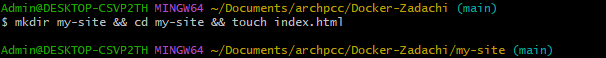
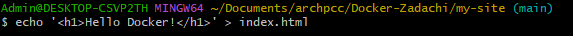
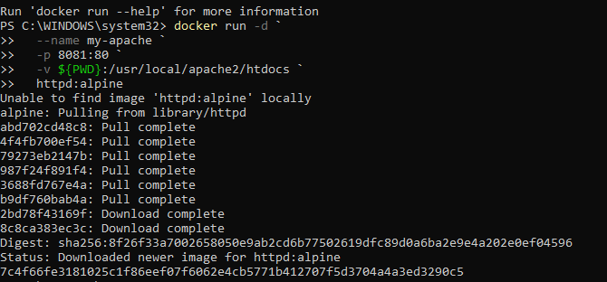

## Статический сайт на Apache (пока не работает одключение тома)


### Apache со стандартной приветственной страницей контейнера

Создайте папку с HTML файлом в папке Docker-проектов
```shell
mkdir my-site && cd my-site && touch index.html
```


```shell
echo '<h1>Hello Docker!</h1>' > index.html
```

> Чтобы в веб-странице поддерживался русский язык, вставьте тэг `<meta charset="UTF-8">`

#### Запустите **Apache** с монтированием папки (для Windows)

Настройки Docker Desktop в Windows
- Откройте `Docker Desktop → Settings → Resources → File Sharing`;
- Убедитесь, что диск `C:\` есть в списке. Если нет – добавьте его;
- Перезапустить компьютер.

#### Запустите **Apache** с монтированием папки ()

> Перед созданием проекта убедитесь, что порт `8081` не занят другим приложением!

<u>Находясь в папке проекта</u> `my-site`, выполните загрузку образа, создание контейнера с сервером и его запуск:

для **Windows Powershell**
```shell
docker run -d `
  --name my-apache `
  -p 8081:80 `
  -v $(pwd):/usr/local/apache2/htdocs `
  httpd:alpine
```



для **Git-Bash/Linux/WSL 2.0/Mac**
```shell
docker run -d \
  --name my-apache \
  -p 8081:80 \
  -v $(pwd):/usr/local/apache2/htdocs \
  httpd:alpine
```

[Откройте: http://localhost:8081](http://localhost:8081)