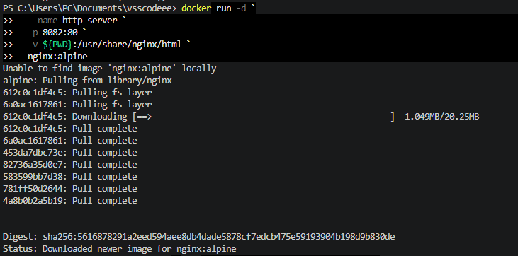
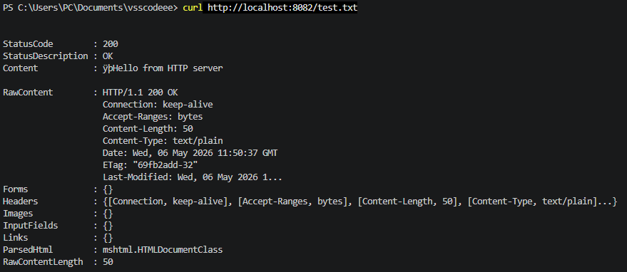

## HTTP-сервер для раздачи файлов

1. Создайте тестовый файл
echo "Hello from HTTP server" > test.txt

2. Запустите простой HTTP сервер

в **Windows Powershell**
```shell
docker run -d `
  --name http-server `
  -p 8082:80 `
  -v ${PWD}:/usr/share/nginx/html `
  nginx:alpine
```


в **Git-Bash/Linux/WSL 2.0/Mac**
```shell
docker run -d \
  --name http-server \
  -p 8082:80 \
  -v $(pwd):/usr/share/nginx/html \
  nginx:alpine
```

3. Проверьте
```shell
curl http://localhost:8082/test.txt
```
