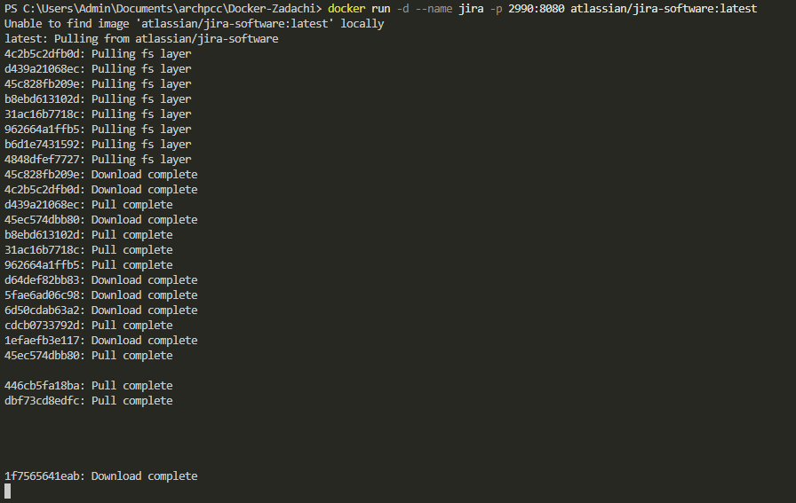
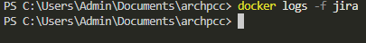
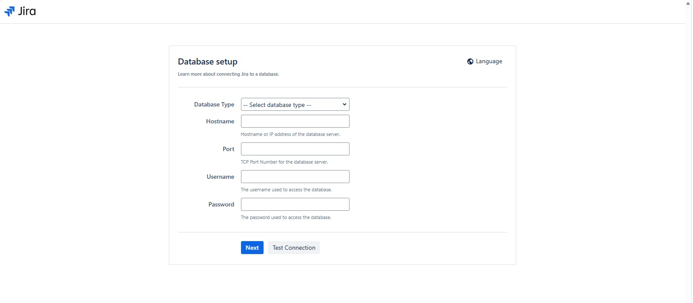

## Jira

Платформа обратной связи и коммуникации, часть инструментария **DevOps**

Загрузить образ, создать и запустить контейнер
```shell
docker run -d --name jira -p 2990:8080 atlassian/jira-software:latest
```
или
```shell
docker run -d --name jira -p 2990:8080 addono/jira-software-standalone
```

Запустите лог Jira для наблюдением за процессом подготовки приложения:
```shell
docker logs -f jira
```

В логах должно быть видна подготовка Jira. Образ при первом запуске долго инициализируется (до 5-10 минут).

Приложение, запущенное в контейнере может готовится долго, поэтому в браузере вы не сразу можете увидеть результат.

По завершению подготовки можно открыть в браузере запущенное приложение Jira:

[Зайти в админ-панель Jira в браузере по адреcу http://localhost:2990](http://localhost:2990)

