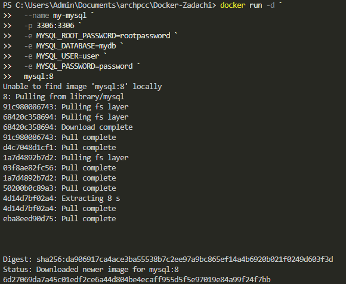
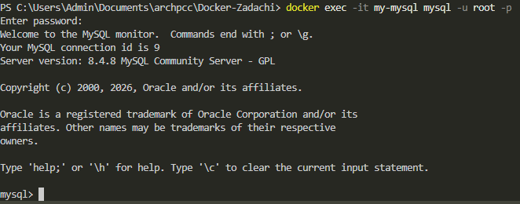
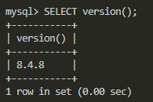
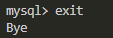

## MySQL база данных

1. Запуск **MySQL**

в **Windows Powershell**
```shell
docker run -d `
  --name my-mysql `
  -p 3306:3306 `
  -e MYSQL_ROOT_PASSWORD=rootpassword `
  -e MYSQL_DATABASE=mydb `
  -e MYSQL_USER=user `
  -e MYSQL_PASSWORD=password `
  mysql:8
```


> Если эта команда в Powershell не работает, то удалите из кода апострофы `

в **Git-Bash/Linux/WSL 2.0/Mac**
```shell
docker run -d \
  --name my-mysql \
  -p 3306:3306 \
  -e MYSQL_ROOT_PASSWORD=rootpassword \
  -e MYSQL_DATABASE=mydb \
  -e MYSQL_USER=user \
  -e MYSQL_PASSWORD=password \
  mysql:8
```

2. Подключиться
```shell
docker exec -it my-mysql mysql -u root -p
```
> Пароль: rootpassword

Получить список баз данных:
```sql
sql
```
Получить версию:
```sql
SELECT version();
```

выйти из БД
```sql
exit
```
