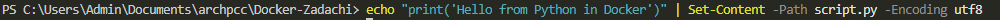
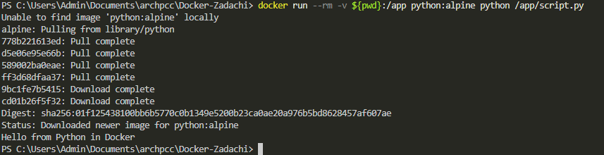
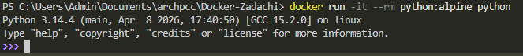

## Python для запуска скриптов

1. Создайте **Python** скрипт

в **Git-bash**
```shell
echo "print('Hello from Python in Docker')" > script.py
```
или в **PowerShell**
```shell
echo "print('Hello from Python in Docker')" | Set-Content -Path script.py -Encoding utf8
```


2. Запустите скрипт в контейнере с **Python**

в **Git-Bash**
```shell
docker run --rm -v "$(pwd)":/app python:alpine python /app/script.py
```
или в **PowerShell**
```shell
docker run --rm -v ${pwd}:/app python:alpine python /app/script.py
```


3. Интерактивный **Python** (опционально)
```shell
docker run -it --rm python:alpine python
```
