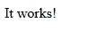
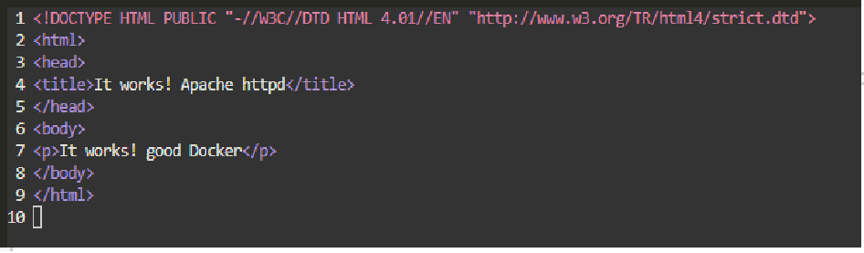
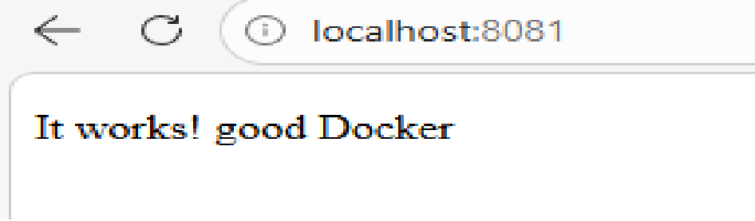

# Apachi
```
    docker run -d --name my-apache -p 8081:80 httpd  
```
получить образ, создать образ и запустить контейнер



## Редактирование веб-страницы
### Зайти в контейнер:
```
    docker exec -it my-apache bash  
```


## Открыть файл index.html для редактирования содержимого:
```
     micro /usr/local/apache2/htdocs/index.html    
```
## Отредактированный вариант:
