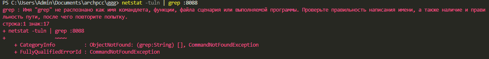
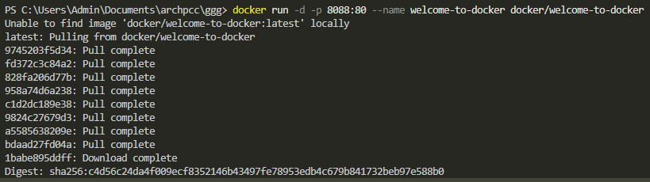
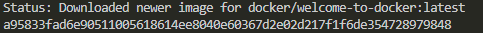
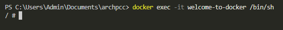
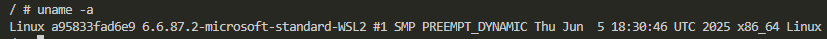
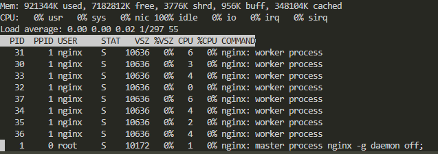
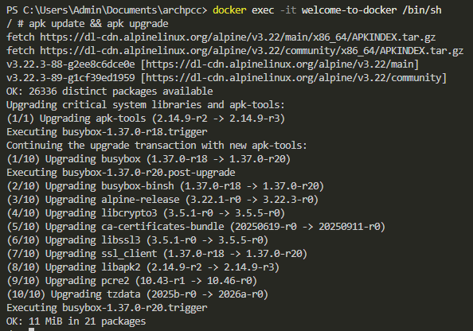
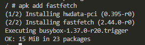
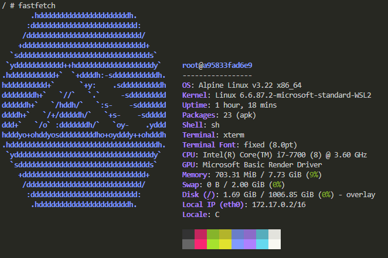

## Проверить порт 8088 для Linux/Mac/WSL:
```
netstat -tuln | grep :8088
```

## Загрузить образ и запустить контейнера
```
docker run -d -p 8088:80 --name welcome-to-docker docker/welcome-to-docker
```
[открыть в браузере локальный хост](http://localhost:8088/)



## Зайти в контейнер
```
docker exec -it welcome-to-docker /bin/sh
```

# Повыполнять разные команды:
## Показать ин-фу по ОС
```
uname -a
```

## Диспетчер ресурсов
```
top
```

## Обновить источники приложений
```
apk update && apk upgrade
```

## Установить приложение
```
apk add fastfetch
```

## Запустить приложение
```
fastfetch
```
